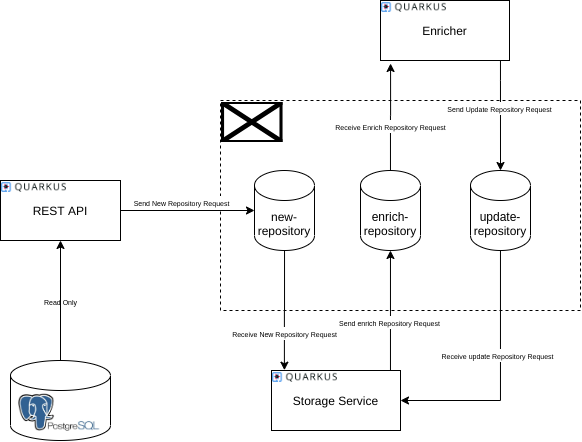

[](https://quarkus.io/)
[](https://www.apache.org/licenses/LICENSE-2.0)
[](https://github.com/quarkusio/quarkus/actions/runs/113853915/)

# Quarkus Catalog Apps

The goal of this application is to automatically analyze Github/Gitlab repositories using Quarkus to extract information like Quarkus version and Quarkus extensions in use.

## Use Cases

- Register GitHub/Gitlab repositories
- Enrich repository data to populate Quarkus extensions and version
- Get the repository data
- Get list of all the registered repositories
- Get statistics of the populated data from all the repositories

## Architecture



## Getting Started

### Prerequisites

- Maven 3.6.X or higher
- JDK 11
- Docker
- docker-compose

### Local Deployment

- Run Kafka and PostgreSQL using docker-compose:

```
cd deployment/docker
docker-compose up
```  

You can also run these components manually following the Kafka instructions [here](https://kafka.apache.org/quickstart) and the next command to run a PostgreSQL instance:

```
docker run -it --name quarkus-app-catalog-postgres -e POSTGRES_USER=sarah -e POSTGRES_PASSWORD=connor -e POSTGRES_DB=quarkusappcatalog -p 5432:5432 postgres:10.5
``` 

- Build:

```
mvn clean install
```

- Start Storage Service:

```
java -jar storage-service/target/storage-service-1.0.1-SNAPSHOT-runner.jar
```

| Note that the storage service will initialize the database if it does not exist.

- Start REST API:

```
java -jar rest-api/target/rest-api-1.0.1-SNAPSHOT-runner.jar
```

| The Swagger-UI will be available at [http://localhost:8081/swagger-ui](http://localhost:8081/swagger-ui)

- Register a repository:

```
curl -X POST -H "Content-type: application/json" --data '{ "repoUrl": "http://github.com/user/repo", "branch": "master" }' "http://localhost:8081/repository"
```

Now, you should see this log in the storage service:

```
(vert.x-worker-thread-0) New repository 'http://github.com/user/repo' with ID 1
```

- Get the repo details

```
curl -X GET -H "Content-type: application/json" "http://localhost:8081/repository/1"
```

- Get all repo 

```
curl -X GET -H "Content-type: application/json" "http://localhost:8081/repository"
```

And it should return:

```
{"id":1,"repoUrl":"http://github.com/user/repo"}
```

### GraphQL

When running the REST API service, it also runs a GraphQL endpoint at `/graphql-ui` (in production mode).

At the moment, there are five queries:

- repositories:

```
{
   repositories {
    id
    repoUrl
    name
    quarkusVersion
    branch
    extensions {
      name
      version
    }
    labels
    createdAt
    updatedAt
    status
   }
}

// It's also possible filter by quarkus version:
{
 repositories(quarkusVersions:["999-SNAPSHOT", "1.10.2.Final"]) {
    id
    repoUrl
    name
    quarkusVersion
    branch
    labels
    createdAt
    updatedAt
    status
 }
}

```

- by repository URL:

```
{
   repositoryByUrl (repoUrl: "http://myrepo/path") {
    id
    repoUrl
    name
    branch
    extensions {
      name
      version
    }
    labels
    createdAt
    updatedAt
    status
   }
}
```

- by repository ID:

```
{
   repositoryById (id: 19) {
    id
    repoUrl
    name
    branch
    extensions {
      name
      version
    }
    labels
    createdAt
    updatedAt
    status
   }
}
```

- repositories that use any of a list of extensions:

```
{
  repositoriesByExtensions(extensions: [{name: "quarkus-grpc", version: "1.10.2.Final"}]) {
    id
    repoUrl
    name
    quarkusVersion
    branch
    labels
    createdAt
    updatedAt
    status
  }
}
```

- repositories that use any of a list of artifactIds:

```
{
  repositoriesByExtensionsArtifactIds(artifactIds: ["quarkus-grpc", "quarkus-jdbc-h2"]) {
    id
    repoUrl
    name
    quarkusVersion
    branch
    labels
    createdAt
    updatedAt
    status
  }
}
```

### Images

- Build:

```
mvn clean package
```

- Push Images to your registry:

```
docker login [your_registry]

docker tag quarkus-qe/quarkus-apps-catalog-storage-service:[current_version] [your_registry]/[your_namespace]/quarkus-apps-catalog-storage-service:[current_version]
docker push [your_registry]/[your_namespace]/quarkus-apps-catalog-storage-service:[current_version]

docker tag quarkus-qe/quarkus-apps-catalog-enricher:[current_version] [your_registry]/[your_namespace]/quarkus-apps-catalog-enricher:[current_version]
docker push [your_registry]/[your_namespace]/quarkus-apps-catalog-enricher:[current_version]

docker tag quarkus-qe/quarkus-apps-catalog-rest-api:[current_version] [your_registry]/[your_namespace]/quarkus-apps-catalog-rest-api:[current_version]
docker push [your_registry]/[your_namespace]/quarkus-apps-catalog-rest-api:[current_version]
```

- Environment Properties for REST API and Storage Service:

```
QUARKUS_DATASOURCE_USERNAME=XXX
QUARKUS_DATASOURCE_PASSWORD=YYY
QUARKUS_DATASOURCE_JDBC_URL=jdbc:postgresql://XXX:YYY/quarkusappcatalog
QUARKUS_HIBERNATE-ORM_DATABASE_DEFAULT-SCHEMA=quarkusappcatalog
KAFKA_BOOTSTRAP_SERVERS=...
```

- Environment Properties for Enricher Service:

```
KAFKA_BOOTSTRAP_SERVERS=...
```

## Release Lifecycle

1. Start release:

```
mvn versions:set -DnewVersion=X.Y.Z-SNAPSHOT
git add --all
git commit -m "Started release X.Y.Z-SNAPSHOT"
git push
```

Once the commit is merged.

2. Create Milestone vX.Y.Z
3. Create issues by tasks (see [task board](https://trello.com/c/RcosHgqo)) with correct milestone vX.Y.Z

- End release:

```
mvn versions:set -DnewVersion=X.Y.Z
git add --all
git commit -m "End release X.Y.Z"
git push
```

Once the commit is merged.

4. Close milestone in GitHub: This will generate a draft release with the release notes.
5. Review Release Notes and if everything looks ok, publish the release.
6. Wait until the new images are pushed into Quay.io. This job is triggered automatically once the release is closed.
7. Deploy release vX.Y.Z into OpenShift using [this jenkins job](https://quarkus-qe-jenkins.rhev-ci-vms.eng.rdu2.redhat.com/job/quarkus-apps-catalog-promote/)

## Useful Links

- [Board](https://trello.com/c/RcosHgqo)
